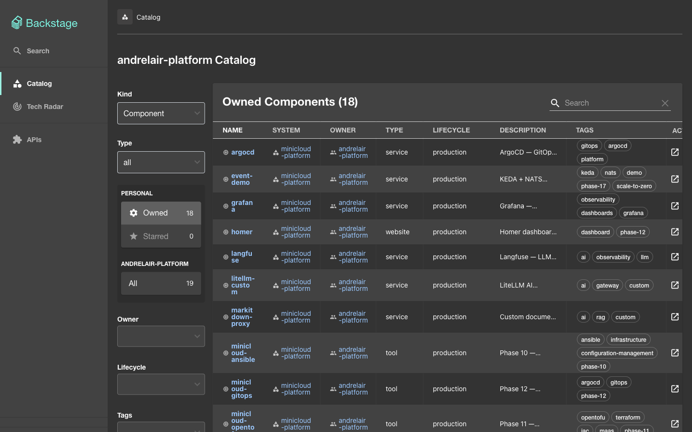
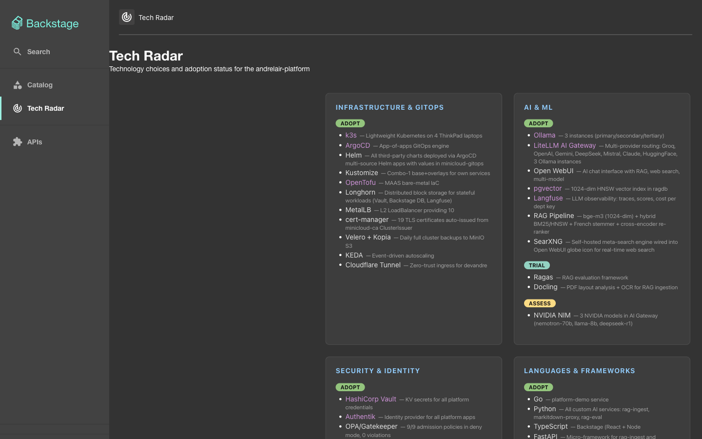
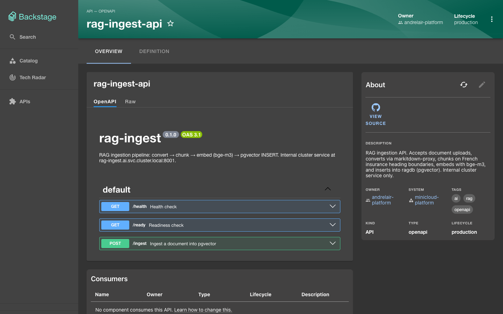
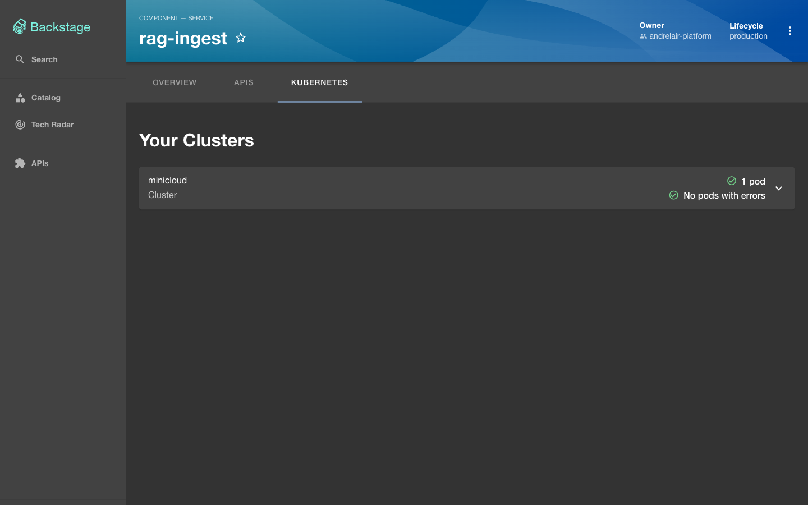
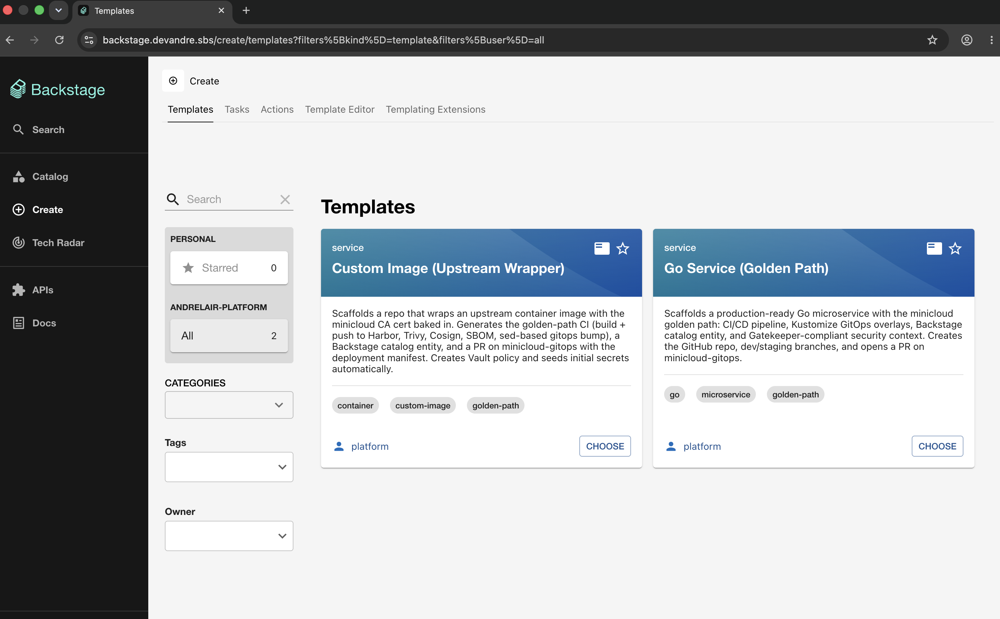
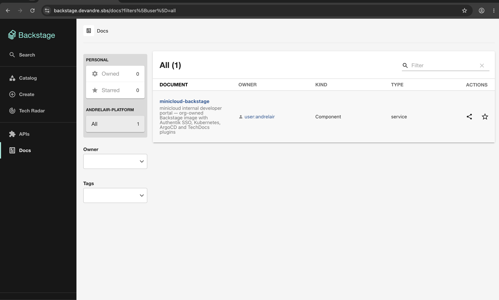

# minicloud-backstage

[](https://github.com/andrelair-platform/minicloud-backstage/actions/workflows/ci.yml)
[](LICENSE)
[](https://backstage.io)
[](https://github.com/sigstore/cosign)

> A production-hardened internal developer portal built on [Backstage](https://backstage.io), deployed on a self-hosted Kubernetes platform. Features a custom Tech Radar, Authentik OIDC SSO, Software Catalog with API Docs, TechDocs, Software Templates, and fully automated GitOps delivery via ArgoCD.

**Live demo:** [https://backstage.devandre.sbs](https://backstage.devandre.sbs)

---

## Screenshots

| Software Catalog | Tech Radar |
|---|---|
|  |  |

| API Docs (Swagger UI) | Kubernetes live view |
|---|---|
|  |  |

| Software Templates | TechDocs |
|---|---|
|  |  |

---

## Table of Contents

- [Features](#features)
- [Architecture](#architecture)
- [Prerequisites](#prerequisites)
- [Getting Started](#getting-started)
- [Project Structure](#project-structure)
- [Configuration](#configuration)
- [CI/CD Pipeline](#cicd-pipeline)
- [Software Templates](#software-templates)
- [Tech Radar](#tech-radar)
- [Troubleshooting](#troubleshooting)
- [Contributing](#contributing)
- [License](#license)

---

## Features

- **Software Catalog** — tracks all platform services, APIs, tools, and infrastructure components (19 registered entities)
- **API Docs** — inline Swagger/OpenAPI UI for every registered API entity
- **TechDocs** — in-portal documentation rendered from `mkdocs.yml` per service; no external doc site needed
- **Kubernetes tab** — live pod status and cluster resource view per component
- **Software Templates** — golden-path scaffolder for new services (`go-service`, `custom-image`); generates repo, CI, gitops manifest, and ArgoCD app in one click
- **Plane Issues tab** — custom `@internal/plugin-minicloud-plane` plugin showing live project issues from Plane CE per catalog entity
- **Tech Radar** — custom 4-quadrant radar (Platforms, AI/ML, Security, Languages) fetched live from [`minicloud-gitops`](https://github.com/andrelair-platform/minicloud-gitops/blob/main/tech-radar.json)
- **OIDC SSO** — single sign-on via Authentik; no separate Backstage user accounts
- **Fully GitOps** — ArgoCD reconciles on every push; no manual `kubectl` steps after bootstrap
- **Supply chain security** — every image is Trivy-scanned, Cosign-signed (keyless via GitHub OIDC → Sigstore Fulcio), and has a CycloneDX SBOM attached as an OCI referrer

---

## Architecture

```
┌─────────────────────────────────────────────┐
│             GitHub Actions CI               │
│  yarn build → Docker push → Trivy scan      │
│  → cosign sign → syft SBOM → gitops bump    │
└────────────────────┬────────────────────────┘
                     │ webhook
┌────────────────────▼────────────────────────┐
│                  ArgoCD                     │
│   watches helm-values/backstage-values.yaml │
│   → Recreate rollout in backstage namespace │
└────────────────────┬────────────────────────┘
                     │
┌────────────────────▼────────────────────────┐
│            Backstage Pod (k3s)              │
│  Node 24 · PostgreSQL · Authentik OIDC      │
│  Harbor registry · Longhorn PVC             │
└─────────────────────────────────────────────┘
```

| Component | Detail |
|---|---|
| Backstage | 1.52.0 — new frontend system (`createApp` from `@backstage/frontend-defaults`) |
| Runtime | `node:24-trixie-slim` |
| Registry | `harbor.10.0.0.200.nip.io/library/backstage` (internal, via Tailscale) |
| Auth | Authentik OIDC (`auth.devandre.sbs`) |
| Database | PostgreSQL — Bitnami subchart, Longhorn PVC |
| GitOps | ArgoCD — values in `minicloud-gitops/helm-values/backstage-values.yaml` |

---

## Prerequisites

| Tool | Version | Notes |
|---|---|---|
| Node.js | ≥ 22 | Required for `isolated-vm@6.x` — Node 20 will fail at build time |
| Yarn | v4 (Berry) | Version managed by `.yarnrc.yml` — do not use npm |
| Docker | any recent | Only needed if building the image locally |

---

## Getting Started

### 1. Clone and install

```bash
git clone https://github.com/andrelair-platform/minicloud-backstage.git
cd minicloud-backstage
yarn install
```

### 2. Run locally

```bash
# Start the frontend dev server with hot reload
# Uses app-config.yaml — points to local/mock backends
yarn start
```

Open [http://localhost:3000](http://localhost:3000). The local app uses `app-config.yaml`; production config is injected via the Helm chart from `minicloud-gitops/helm-values/backstage-values.yaml`.

### 3. Build

```bash
# TypeScript type check
yarn tsc

# Compile backend bundle (required before Docker build)
yarn build:backend
```

### 4. Build the Docker image locally (optional)

```bash
yarn build:backend
docker build -f packages/backend/Dockerfile -t backstage:local .
```

> **Note:** The CI pipeline handles image builds automatically on push to `main`. Manual builds are only needed for local testing.

---

## Project Structure

```
minicloud-backstage/
├── packages/
│   ├── app/                          # React frontend
│   │   └── src/
│   │       ├── App.tsx               # createApp() — registers all FrontendFeature plugins
│   │       └── modules/
│   │           ├── auth.tsx          # SignInPageBlueprint (Authentik OIDC)
│   │           ├── nav/
│   │           │   ├── Sidebar.tsx   # NavContentBlueprint — layout + Tech Radar link
│   │           │   └── SidebarLogo.tsx
│   │           └── tech-radar/
│   │               ├── index.tsx     # createFrontendPlugin — registers /tech-radar route
│   │               └── TechRadarPage.tsx  # Fetches tech-radar.json, renders 4-quadrant grid
│   └── backend/
│       └── src/
│           ├── index.ts              # Backend entry point
│           └── plugins/              # Backend plugin wiring
├── plugins/
│   └── minicloud-plane/              # Custom plugin — Plane Issues tab per catalog entity
│       └── src/
│           ├── plugin.ts             # createFrontendPlugin — registers EntityPlaneIssuesContent
│           └── components/
├── templates/
│   ├── go-service/                   # Golden-path template for new Go microservices
│   │   ├── template.yaml             # Scaffolder template definition
│   │   └── skeleton/                 # Service + gitops directory trees
│   └── custom-image/                 # Template for custom Docker images (CA cert pattern)
│       ├── template.yaml
│       └── skeleton/                 # Dockerfile + CI skeleton
├── docs/                             # TechDocs source (MkDocs)
├── mkdocs.yml                        # TechDocs config for this repo's own docs
├── app-config.yaml                   # Local development config (never loaded in prod)
├── catalog-info.yaml                 # Backstage self-registration entity
├── .github/
│   └── workflows/
│       ├── ci.yml                    # Build → push → sign → SBOM → gitops bump
│       └── release.yml               # Semver tagging workflow
└── playwright.config.ts              # E2E test config
```

---

## Configuration

### Critical: where production config lives

**`app-config.yaml` in this repo is LOCAL DEV ONLY — it is never loaded in production.**

The Helm chart overrides the Dockerfile CMD and loads config from ConfigMap `backstage-app-config` instead. That ConfigMap is rendered from `minicloud-gitops/helm-values/backstage-values.yaml`.

To add a catalog location, proxy endpoint, or any production config:
1. Edit `minicloud-gitops/helm-values/backstage-values.yaml`
2. `git commit && git push origin main`
3. ArgoCD auto-syncs the ConfigMap within ~30s
4. `kubectl rollout restart deployment/backstage -n backstage`

### Environment variables (injected by Helm)

| Variable | Source | Purpose |
|---|---|---|
| `SESSION_SECRET` | `backstage-phase24-secret` | Express session signing key |
| `AUTH_OIDC_CLIENT_ID` | `backstage-phase24-secret` | Authentik OAuth2 client ID |
| `AUTH_OIDC_CLIENT_SECRET` | `backstage-phase24-secret` | Authentik OAuth2 client secret |
| `K8S_SA_TOKEN` | `backstage-phase24-secret` | ServiceAccount token for the Kubernetes plugin |
| `K8S_CA_DATA` | `backstage-phase24-secret` | Cluster CA certificate (base64) |
| `ARGOCD_USERNAME` | `backstage-phase24-secret` | ArgoCD read-only user |
| `ARGOCD_PASSWORD` | `backstage-phase24-secret` | ArgoCD read-only password |
| `NODE_EXTRA_CA_CERTS` | mounted ConfigMap `minicloud-ca` | Trusts the self-signed minicloud CA for in-cluster OIDC calls |

> All secrets are managed by [External Secrets Operator](https://external-secrets.io) pulling from HashiCorp Vault. Nothing is hardcoded.

### Key config paths in `backstage-values.yaml`

```yaml
auth:
  providers:
    oidc:
      production:
        metadataUrl: https://auth.devandre.sbs/application/o/backstage/.well-known/openid-configuration

backend:
  csp:
    connect-src: ["'self'", "https://raw.githubusercontent.com"]  # allows Tech Radar fetch
  reading:
    allow:
      - host: raw.githubusercontent.com   # allows Catalog to read GitHub-hosted entity files

proxy:
  endpoints:
    '/minicloud-plane':
      target: 'http://minicloud-plane.minicloud-plane-dev.svc.cluster.local:8080'
      changeOrigin: true
```

---

## CI/CD Pipeline

Every push to `main` triggers `.github/workflows/ci.yml`:

```
push to main
    │
    ├─ 1. Connect to Tailscale (OAuth — TS_OAUTH_CLIENT_ID / TS_OAUTH_SECRET)
    ├─ 2. Trust minicloud CA (raw PEM — no base64 decode)
    ├─ 3. yarn install + yarn tsc + yarn build:backend  (Node 22)
    ├─ 4. docker build → push to harbor.10.0.0.200.nip.io/library/backstage:<sha>-amd64
    ├─ 5. Trivy scan — fails on unfixed CRITICAL CVEs
    ├─ 6. cosign sign (keyless — GitHub OIDC → Sigstore Fulcio)
    ├─ 7. syft SBOM (CycloneDX JSON) — attached as OCI referrer
    └─ 8. GPG-signed commit to minicloud-gitops bumping backstage-values.yaml
              └─ ArgoCD webhook → Recreate rollout in backstage namespace
```

### Required secrets

All 7 secrets are **org-level on `andrelair-platform`** (set 2026-07-15, visibility: all). New repos inherit them automatically — no per-repo secret setup needed.

| Secret | Purpose |
|---|---|
| `TS_OAUTH_CLIENT_ID` | Tailscale OAuth client ID — joins tailnet as `tag:ci` |
| `TS_OAUTH_SECRET` | Tailscale OAuth secret |
| `MINICLOUD_CA_CERT` | Self-signed CA PEM — lets Docker daemon and cosign trust Harbor TLS |
| `HARBOR_USER` | Harbor registry username |
| `HARBOR_PASSWORD` | Harbor registry password |
| `GITOPS_TOKEN` | GitHub PAT (`repo` scope) for committing to `minicloud-gitops` |
| `GPG_PRIVATE_KEY` | Armored GPG private key for signing gitops commits (key ID `FD6D39D681DEFA34`) |

---

## Software Templates

Two golden-path templates are registered in Backstage at `/create`:

### `go-service`

Scaffolds a full Go microservice from scratch in one Backstage action:

1. Creates the service repo from skeleton (Go HTTP server, Dockerfile, CI pipeline)
2. Creates the GitOps overlay in `minicloud-gitops` (Kustomize base + dev/staging/prod overlays, VPA object, ArgoCD app)
3. Opens a PR against `minicloud-gitops` for review
4. Registers the new component in the Backstage catalog

Output: a deployable service with CI, GitOps, and catalog entry — push to `dev` branch to trigger the first build.

### `custom-image`

Scaffolds a custom Docker image repo following the minicloud CA-injection pattern (`ARG CA_CERT` + build-arg from secret). Useful for third-party images that need the internal CA baked in.

---

## Tech Radar

The Tech Radar page (`/tech-radar`) is a custom module — it does **not** use `@backstage/plugin-tech-radar` because that package ships a conflicting nested version of `@backstage/frontend-plugin-api` that causes the plugin to be silently dropped at runtime.

The radar data is fetched live from:
```
https://raw.githubusercontent.com/andrelair-platform/minicloud-gitops/main/tech-radar.json
```

To update the radar content, edit [`tech-radar.json`](https://github.com/andrelair-platform/minicloud-gitops/blob/main/tech-radar.json) in `minicloud-gitops` — no image rebuild needed.

---

## Troubleshooting

| Symptom | Cause | Fix |
|---|---|---|
| Pod stuck at `0/1` after deploy | Started before PostgreSQL was ready — new backend does not retry | `kubectl delete pod -n backstage -l app.kubernetes.io/name=backstage --force --grace-period=0` |
| `NotImplementedError: apiRef{plugin.search.queryservice}` | A plugin that uses `SidebarSearchModal` is loaded but `@backstage/plugin-search/alpha` is not in `features` | Add `searchPlugin` to the `features` array in `App.tsx` |
| Build fails with `v8::SourceLocation` error | Node 20 — `isolated-vm@6.x` requires Node 22+ | Use Node 22 or later |
| Plugin silently missing at runtime | Nested `frontend-plugin-api` version conflict | Avoid installing `@backstage/plugin-tech-radar` — use the local `modules/tech-radar` instead |
| Harbor push fails in CI | BuildKit container does not inherit `/etc/docker/certs.d/` | The buildkitd config in `ci.yml` sets `insecure = true` for Harbor (traffic is over Tailscale) |
| Plane Issues tab shows no data | `plane.io/project-id` annotation missing on catalog entity | Add `plane.io/project-id: "PT"` (or your project identifier) to the entity's `catalog-info.yaml` |
| VPA restart loop after enabling Auto | Short `startupProbe` fails before VPA sets new resource limits | Set `startupProbe.failureThreshold: 30` (5 min) and `minAllowed.cpu: 200m` in the VPA object |

---

## Contributing

See [CONTRIBUTING.md](CONTRIBUTING.md) for branch conventions, commit style, and how to propose changes.

---

## License

[MIT](LICENSE) © andrelair-platform
